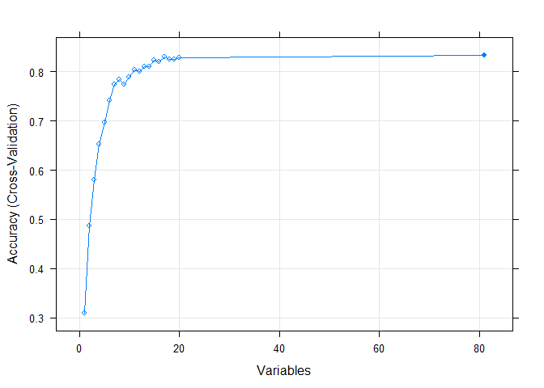
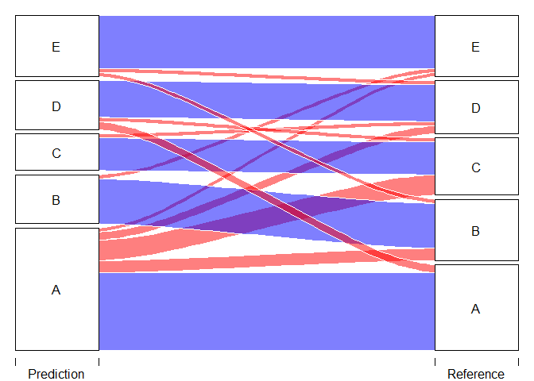

Overview
--------

The goal of your project is to predict the manner in which 6
participants did a Weight lifting exercise, using data from
accelerometers on the belt, forearm and arm. This is the “classe”
variable in the training set.

Participants were asked to perform one set of 10 repetitions of the
Unilateral Dumbbell Biceps Curl in five different fashions: exactly
according to the specification (Class A), throwing the elbows to the
front (Class B), lifting the dumbbell only halfway (Class C), lowering
the dumbbell only halfway (Class D) and throwing the hips to the front
(Class E). Class A corresponds to the specified execution of the
exercise, while the other 4 classes correspond to common mistakes.

The data for this project come from this source:
<a href="http://web.archive.org/web/20161224072740/http:/groupware.les.inf.puc-rio.br/har" class="uri">http://web.archive.org/web/20161224072740/http:/groupware.les.inf.puc-rio.br/har</a>.

Data loading, preprocessing and crossvalidation
-----------------------------------------------

We will load the data from the training set and make some basic
preprocessing. There are several derived features in each step of the
sliding window approach. we will keep only the rows were these features
appear and removed the rest of observations and the features used to
derived these new ones (x ,y, z) since they are not necessary. We will
remove also the variables used for the sliding window approach.

``` r
data <- read.csv("pml-training.csv", na.strings = c("NA","#DIV/0!"))
data <- data[,-1]

na <- apply(data,2,function(x){sum(is.na(x))})/nrow(data)
features <- c("classe", "user_name", colnames(data[,na>0.8])) #classe, user and derived features

data <- data[data$new_window=="yes",]
data <- data[,features]
```

There are still some variables with no variability in them that should
be removed.

``` r
library(lattice); library(ggplot2);library(caret); library(RANN)

nzv <- nearZeroVar(data,saveMetrics = TRUE)$nzv
data <- data[, !nzv]
```

we will remove variables with more than 10% NAs ans the rest will be
inputed with knn method.

``` r
na <- apply(data,2,function(x){sum(is.na(x))})/nrow(data)
data <- data[,na<0.1]

preObj <- preProcess(data[,-1], method = "knnImpute")
datapre <- predict(preObj, data[,-1]) 
datapre$classe <- data$classe
```

There are still too many variables, we will try to reduce them by a
recursive feature elimination RFE algorithm.

``` r
control <- rfeControl(functions=rfFuncs, method="cv", number=10)
rfe <- rfe(datapre[,2:82], datapre[,83], sizes=c(1:20), rfeControl=control)

#print(rfe)
features <- predictors(rfe)
plot(rfe, type=c("g", "o"))
```



``` r
datarfe <- datapre[,features]
M <- abs(cor(datarfe))
diag(M) <- 0
cor <- which(M>0.90, arr.ind=T)

#We remove 1 more variable highly correlated that doesn't make much sense to keep.
features <- colnames(datarfe[,-c(5)])
dataf <- datapre[,features]
dataf$classe <- datapre$classe
```

We will keep a random subset inside the training set to validate the
models.

``` r
set.seed(1)
inTrain <- createDataPartition(y=dataf$classe, p=0.8, list=FALSE)
training <- dataf[inTrain,]
testing <- dataf[-inTrain,]
```

Model training and expected error
---------------------------------

We will try different models to see how they perform, all using repeated
k-fold cross validation.

``` r
train_control <- trainControl(method="repeatedcv", number=10, repeats=3)

#Naive Bayes
modFit1 <- train(classe~., data=training, trControl=train_control, method="nb")
pre1 <- predict(modFit1, newdata=testing)
acc1 <- confusionMatrix(pre1,testing$classe)$overall[1]

#Random forest
modFit2 <- train(classe~., data=training, trControl=train_control, method="rf")
pre2 <- predict(modFit2, newdata=testing)
acc2 <- confusionMatrix(pre2,testing$classe)$overall[1]

#Boosting
modFit3 <- train(classe~., data=training, trControl=train_control, method="gbm")
pre3 <- predict(modFit3, newdata=testing)
acc3 <- confusionMatrix(pre3,testing$classe)$overall[1]
```

Summary of the 3 models:

``` r
print(modFit1);print(modFit2);print(modFit3)
```

    ## Naive Bayes 
    ## 
    ## 328 samples
    ##  80 predictor
    ##   5 classes: 'A', 'B', 'C', 'D', 'E' 
    ## 
    ## No pre-processing
    ## Resampling: Cross-Validated (10 fold, repeated 3 times) 
    ## Summary of sample sizes: 295, 294, 298, 296, 295, 295, ... 
    ## Resampling results across tuning parameters:
    ## 
    ##   usekernel  Accuracy   Kappa    
    ##   FALSE      0.4817850  0.3594903
    ##    TRUE      0.5832866  0.4734394
    ## 
    ## Tuning parameter 'fL' was held constant at a value of 0
    ## Tuning
    ##  parameter 'adjust' was held constant at a value of 1
    ## Accuracy was used to select the optimal model using the largest value.
    ## The final values used for the model were fL = 0, usekernel = TRUE and adjust
    ##  = 1.

    ## Random Forest 
    ## 
    ## 328 samples
    ##  80 predictor
    ##   5 classes: 'A', 'B', 'C', 'D', 'E' 
    ## 
    ## No pre-processing
    ## Resampling: Cross-Validated (10 fold, repeated 3 times) 
    ## Summary of sample sizes: 296, 296, 296, 295, 295, 296, ... 
    ## Resampling results across tuning parameters:
    ## 
    ##   mtry  Accuracy   Kappa    
    ##    2    0.8043771  0.7508229
    ##   41    0.8032129  0.7506913
    ##   80    0.7870438  0.7305866
    ## 
    ## Accuracy was used to select the optimal model using the largest value.
    ## The final value used for the model was mtry = 2.

    ## Stochastic Gradient Boosting 
    ## 
    ## 328 samples
    ##  80 predictor
    ##   5 classes: 'A', 'B', 'C', 'D', 'E' 
    ## 
    ## No pre-processing
    ## Resampling: Cross-Validated (10 fold, repeated 3 times) 
    ## Summary of sample sizes: 293, 297, 295, 295, 296, 295, ... 
    ## Resampling results across tuning parameters:
    ## 
    ##   interaction.depth  n.trees  Accuracy   Kappa    
    ##   1                   50      0.7294930  0.6567768
    ##   1                  100      0.7632558  0.7002832
    ##   1                  150      0.7652148  0.7029946
    ##   2                   50      0.7590586  0.6950647
    ##   2                  100      0.7761053  0.7169112
    ##   2                  150      0.7872576  0.7309660
    ##   3                   50      0.7839746  0.7268243
    ##   3                  100      0.8092824  0.7585778
    ##   3                  150      0.8013951  0.7487223
    ## 
    ## Tuning parameter 'shrinkage' was held constant at a value of 0.1
    ## 
    ## Tuning parameter 'n.minobsinnode' was held constant at a value of 10
    ## Accuracy was used to select the optimal model using the largest value.
    ## The final values used for the model were n.trees = 100, interaction.depth =
    ##  3, shrinkage = 0.1 and n.minobsinnode = 10.

Accuracy for the 3 models are:

``` r
acc1;acc2;acc3
```

    ##  Accuracy 
    ## 0.6666667

    ##  Accuracy 
    ## 0.7692308

    ##  Accuracy 
    ## 0.7692308

We will keep the random forest model (modFit2), which has the highest
accuracy.

``` r
library(alluvial)
source("plotCM.R")
plotCM(confusionMatrix(pre2,testing$classe))
```


